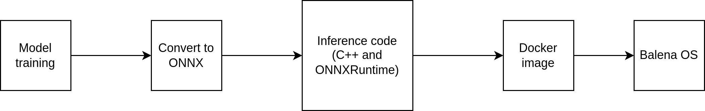

# MLOps

**Contents:**

+ [Introduction](#introduction)
+ [Pipeline](#pipeline)
   + [Model and dataset versioning](#model-and-dataset-versioning)
   + [Our choice of tools](#our-choice-of-tools)
   + [Edge Devices](#edge-devices)
      + [Raspberry Pi](#raspberry-pi)
      + [Jetson](#jetson)
      + [Challenges and Solutions](#challenges-and-solutions)
   + [Datasets](#datasets)
+ [Model training](#model-training)
+ [ONNXRuntime cross compiling](#onnxruntime-cross-compiling)
   + [Manual compilation](#1-manual-compilation)
   + [Docker image](#2-docker-image)
+ [How to guides](#how-to-guides)

## Introduction
MLOps is an emerging field of ML research that aims to enable and automate ML models into production. According to [sig-mlops](https://github.com/cdfoundation/sig-mlops) MLOps is defined as:

> the extension of the DevOps methodology to include Machine Learning and Data Science assets as first class citizens within the DevOps ecology

In this repository we won't discuss benfites and limitations of MLOps, but we provide some references for those who are interested in using MLOps.

- [Very detailed tutorial in MLOps](https://ml-ops.org/)
- [The difference between DevOps and MLOps](https://hackernoon.com/why-is-devops-for-machine-learning-so-different-384z32f1)
- [AutoML organization and tools](https://www.automl.org/)

**Note:** AutoML is a technology that targets non-expert ML practitioners to build and deploy ML models. It can be used in conjuction with MLOps. However, it is fairly in early stages and we're not going to discuss it here.

## Pipeline

Based on our research and the requirements of the project, we decided to use the following pipeline:

1. **Model and dataset versioning:** As ML-base software is fundamentally different from traditional software, model and dataset versioning is an issue and cannot be handled just by using git (as the amount of data is too large).
2. **Automatic model training:** We will autmoate the training of a face detection/recognition model.
3. **Automatic build:** The process of packaging will be automated (creation of Docker images, building of Docker containers, etc.).
4. **Automatic deployment:** The Docker images will be deployed to a local server automatically.
5. **Model monitoring:** We will provide simple logging and monitoring tools to monitor the performance of the model.
6. **Metadata gathering:** During whole pipeline execution, some metadata will be gathered and stored in the database.
7. **Triggering mechanisms:** The pipeline execution triggering mechanism will be based on pipeline change and manual triggering.
8. **Choosing edge devices:** Learning about various edge devices, their limits, and the various models that can be used with them.
9. **Testing datasets:** Examining and evaluating a few datasets that have been processed by edge devices.

A discussion of currently available tools for each stage of the pipeline is provided below.

### Model and dataset versioning

As mentioned briefly above, ML-base software is different from traditional software in that it is not enough to only have code, but also one need whole dataset to produce the exact model. Plus, the explicit relationship between input and output is not known. So, it requires special attention to versioning.

Git is widely used in versioning and source control for traditional software. However, it is not suitable for ML-base software. The dataset is too large and it is not feasible to index it in git. Models are binary and switching between different versions of the model is not easy. There are other reasons that git alone is not suitable for ML-base software. You can refer to [this](https://github.com/cdfoundation/sig-mlops/blob/main/roadmap/2022/MLOpsRoadmap2022.md#challenges) for more information.

Tools for versioning ML-base software:

1. **[DVC:](https://dvc.org/)** An open-source git-based version control system for ML projects. It is by far the most popular version control system in the wild.
2. **[dotmesh:](https://dotmesh.com/)** According to [dotmesh](https://github.com/dotmesh-io/dotmesh)
   > dotmesh (dm) is like git for your data volumes (databases, files etc) in Docker and Kubernetes

`dotmesh` doesn't have an active community and the latest release was in 2020. So, `DVC` is the best and pretty the only solution for version control. Some important features of `DVC` are (according to [DVC features](https://dvc.org/features)):

- Git-compatible
- Storage agnostic
- Reproducible
- Low friction branching
- Metric tracking
- ML pipeline framework
- Language and framework agnostic
- Track failures

So, we are considering to use DVC as a version and CI/CD app.

Tools for CI/CD

The other option for us is jenkins. This open-source software can provide us with a pipeline that could be run right after the version-control app but it does not provide any version-control itself unlike Gitlab and DVC.

Other option is docker compose but we have the same problem as jenkins. It does not provide any version-control for us.

We are considering the choice between DVC and gitlab as both of these tools are very useful in our case .

### Our choice of tools
We are focusing on developing MLOps techniques for edge devices. Edge devices are quite versatile and designed by different manufacturers. So, we need to have a tool that is compatible with different edge devices and to be device-agnostic. Another important feature is to be framework-agnostic. In other words, we should be able to use all models that are trained with different frameworks, without any modification. To tackle this two issues, we used the following pipeline:



`ONNX` standard helps us to be framework agnostic. Almost all training frameworks support ONNX and one can convert the final model to a `.onnx` format and later use it in inference frameworks that support this format (such as `OpenVINO` and `ONNXRuntime`). For inference side, we are going to use `ONNXRuntime`. It is a cross-platform inference engine that supports multiple frameworks and hardware accelerators. So, it's a great choice for edge devices. 

Plus we are using `Docker` to package our application and it's dependencies. It also helps us to create a CI/CD pipeline which is essential for MLOps. As `Docker` it self could be inefficient for edge devices, we are using `balenaOS` which is a lightweight OS, tailored for each hardware with capabilities to run `Docker` containers. Under the hood, `balenaOS` uses `yocto` to build the image file. As of writing this doc, it supports more than 80 devices. More information about `balenaOS` can be found [here](https://www.balena.io/os/).

## Model Training
For the model in this project, we decided to use the IMDB movie reviews dataset. This dataset contains reviwes from users for movies which are labeled either a positive review or a negative review. The format of each data in this dataset is an array of numbers which represent a word in this dataset's dictionary. </br>
For example the word "film" is indexed as integer 13 in this dataset. 
An example:
```
print(data[0])


[1, 14, 22, 16, 43, 530, 973, 1622, 1385, 65, 458, 4468, 66, 3941, 4, 173, 36, 256, 5, 25, 100, 43, 838, 112, 50, 670, 2, 9, 35, 480, 284, 5, 150, 4, 172, 112, 167, 2, 336, 385, 39, 4, 172, 4536, 1111, 17, 546, 38, 13, 447, 4, 192, 50, 16, 6, 147, 2025, 19, 14, 22, 4, 1920, 4613, 469, 4, 22, 71, 87, 12, 16, 43, 530, 38, 76, 15, 13, 1247, 4, 22, 17, 515, 17, 12, 16, 626, 18, 2, 5, 62, 386, 12, 8, 316, 8, 106, 5, 4, 2223, 5244, 16, 480, 66, 3785, 33, 4, 130, 12, 16, 38, 619, 5, 25, 124, 51, 36, 135, 48, 25, 1415, 33, 6, 22, 12, 215, 28, 77, 52, 5, 14, 407, 16, 82, 2, 8, 4, 107, 117, 5952, 15, 256, 4, 2, 7, 3766, 5, 723, 36, 71, 43, 530, 476, 26, 400, 317, 46, 7, 4, 2, 1029, 13, 104, 88, 4, 381, 15, 297, 98, 32, 2071, 56, 26, 141, 6, 194, 7486, 18, 4, 226, 22, 21, 134, 476, 26, 480, 5, 144, 30, 5535, 18, 51, 36, 28, 224, 92, 25, 104, 4, 226, 65, 16, 38, 1334, 88, 12, 16, 283, 5, 16, 4472, 113, 103, 32, 15, 16, 5345, 19, 178, 32]
```

If we translate the entry above we will get this:
```

# this film was just brilliant casting location scenery story direction everyone's really suited the part they played and you could just imagine being there robert # is an amazing actor and now the same being director # father came from the same scottish island as myself so i loved the fact there was a real connection with this film the witty remarks throughout the film were great it was just brilliant so much that i bought the film as soon as it was released for # and would recommend it to everyone to watch and the fly fishing was amazing really cried at the end it was so sad and you know what they say if you cry at a film it must have been good and this definitely was also # to the two little boy's that played the # of norman and paul they were just brilliant children are often left out of the # list i think because the stars that play them all grown up are such a big profile for the whole film but these children are amazing and should be praised for what they have done don't you think the whole story was so lovely because it was true and was someone's life after all that was shared with us all

```
The "#" characters are the ones that are not available in model's dictionary.


The directory ```saved_model``` contains saved model from tensorflow.</br>
The directory ```convert_model``` contains the onnx model.</br>
To get the onnx output use the command below:
```
$>python -m tf2onnx.convert --saved-model ./saved_model/ --opset 12 --output ./convert_model/output.onnx
```
## ONNXRuntime Cross Compiling
We have cross compiled ORT for armv7 architecture and tested it on Raspberry Pi 400. First, clone onnxruntime repository and a custom protoc version for cross compiling (refer to [ORT](https://onnxruntime.ai/docs/build/inferencing.html#arm) documentation for more details). You can either follow these steps to compile ORT manually or use the Dockerfile provided in this repository. First, manual steps are explained and then using Docker is introduced.
### 1) Manual compilation
I have used the following `tool.cmake` file for cross compiling:

```cmake
SET(CMAKE_SYSTEM_NAME Linux)
SET(CMAKE_SYSTEM_VERSION 1)
SET(CMAKE_SYSTEM_PROCESSOR armv7-a)

SET(CMAKE_SYSROOT <path to sysroot>)

SET(CMAKE_C_COMPILER arm-none-linux-gnueabihf-gcc)
SET(CMAKE_CXX_COMPILER arm-none-linux-gnueabihf-g++)

SET(CMAKE_CXX_FLAGS "${CMAKE_CXX_FLAGS} -Wno-psabi")

SET(CMAKE_FIND_ROOT_PATH_MODE_PROGRAM NEVER)
SET(CMAKE_FIND_ROOT_PATH_MODE_LIBRARY ONLY)
SET(CMAKE_FIND_ROOT_PATH_MODE_INCLUDE ONLY)
SET(CMAKE_FIND_ROOT_PATH_MODE_PACKAGE ONLY)
```

Make sure that ARM toolchain is accessible from PATH (otherwise provide absolute path). You might want to transfer linker and some exectuables to your `/usr` path (such as `ld-linux-armhf.so.3` to `/usr/arm-linux-gnueabihf/`).

I compiled v1.12.1 of ORT. It seems that v1.13 has some issues with cmake. So, make sure to use v1.12.1:

```bash
$ git checkout v.1.12.1
```

Next, run the following command to cross compile ORT:

```bash
./build.sh --config Release --parallel --arm --update --build --build_shared_lib --cmake_extra_defines ONNX_CUSTOM_PROTOC_EXECUTABLE=<path to bin/protoc> CMAKE_TOOLCHAIN_FILE=<path to tool.cmake>
```

After waiting a long time, dynamic and static libraries will be generated. You can find them in `build/Linux/Release/` directory. Set this path in `CMakeLists.txt` to compile this project. Also set include directory path in `CMakeLists.txt` and change `TC-arm.cmake` accordingly. Finally, build the project (from `build` folder):

```bash
$ cmake -DCMAKE_TOOLCHAIN_FILE=<path to TC-arm.cmake> -DCMAKE_INSTALL_PREFIX=<install prefix> ..
$ make 
$ make install
```
And you're all set!

### 2) Docker image
You can use the Dockerfile provided in this repository to build a Docker image that will cross compile your project with ORT libraries. The final image can be used either manually or as a base image for your project. Image is built on `Ubuntu:22.04` base image. The final image is around 4GB. You can build the image with the following command (make sure that you are in this repository's root directory):

```bash
$ docker build . -t edgemlops:1.0.0
```

Image building process could take about two hours (depending on your machine and internet speed). After building the image, ORT libraries are in `/ORT/onnxruntime/` directory. 


___
## MQTT Managers

In the  ```mqtt``` folder, there are 2 programs. One for the host machine that manages the devices that are connected and are supposed to run the model and one for the clients on edge. These programs need a broker to be able to communicate with each other. To do so you can use a broker such as mosquitto to setup your own broker. </br>
To use these programs, you need to compile them using the Eclipse Paho MQTT C library. </br>https://github.com/eclipse/paho.mqtt.c</br>
Make sure to edit the CMakeLists file to build the static libraries as well. </br>
To connect to the program, simply enter the IP of the broker as an argument:
```bash
$ ./hostManager "192.168.1.110"
```
The program for the host manager must be in the same folder as other folders such as scripts and inference. To make the inference program, you need to already have the docker image in order for program to use it. </br>
The scripts folder is a simple implementation of the operations that we want to use as a host such as moving files to the edge device, instructions for compiling the inference program and other similar scripts. 
___
## Edge Devices

When it comes to choosing the right edge device, It's important to consider our specific use case. There are several options available in the market, but two popular choices are Raspberry Pi and Jetson. In the following, we'll provide a comparative analysis of these devices.

### Raspberry Pi
The Raspberry Pi is a popular choice for edge computing due to its low cost and versatility. It is a credit-card sized computer that can run various operating systems, including Linux and Windows.

Running a ML program in a Raspberry Pi requires a significant amount of memory (or RAM) to process calculations. The lastest and preferred model for ML applications is the [Raspberry Pi 4 Model B](https://www.raspberrypi.com/products/raspberry-pi-4-model-b/?variant=raspberry-pi-4-model-b-8gb).

Typical ML projects for the Raspberry Pi involve [classifying items](https://www.geeksforgeeks.org/getting-started-with-classification/), including different visual, vocal, or statistical patterns. The backbone of all ML models is a software library and its dependencies. There are currently a variety of free ML frameworks. Some of most well-known platforms include the following:

- [TensorFlow](https://www.tensorflow.org/overview): A flexible platform for building general ML models.
- [OpenCV](https://opencv.org/about/): A library dedicated to computer vision and related object detection tasks.
- [Google Assistant](https://developers.google.com/assistant/sdk/): A library dedicated to voice recognition tasks.
- [Edge Impulse](https://www.edgeimpulse.com/about): A cloud-based platform that simplifies ML app development.

Raspberry Pi can be used to train and run ML models for image classification. For example, you can use TensorFlow to train a model on a dataset of images and then use it on a Raspberry Pi to classify new images in real-time. </br>
Here is some tutorial on building a real-time object recognition on Raspberry Pi using TensorFlow and OpenCV:</br>
- [TensorFlow object detection](https://www.tensorflow.org/lite/examples/object_detection/overview)</br>
- [PyImageSearch object detection](https://pyimagesearch.com/2017/10/16/raspberry-pi-deep-learning-object-detection-with-opencv/)</br>
- [PyImageSearch face recognition](https://pyimagesearch.com/2018/06/25/raspberry-pi-face-recognition/)

Other varied uses, such as voice recognition and anomaly detection, are covered in the tutorials and examples here:</br>
- [TensorFlow projects](https://www.tensorflow.org/lite/examples)</br>
- [Webcrawler](https://peppe8o.com/use-raspberry-pi-as-your-personal-web-crawler-with-python-and-scrapy/)</br>
- [Deep learning examples](https://qengineering.eu/deep-learning-examples-on-raspberry-32-64-os.html)

For more information about Raspberry Pi click [here](https://vilros.com/blogs/news/how-raspberry-pi-can-be-used-for-ml-applications)

### Jetson
Jetson is a line of embedded systems designed by NVIDIA specifically for edge computing applications. Jetson devices are equipped with a powerful GPU, which makes them ideal for tasks such as image and video processing, machine learning, and deep learning. Jetson devices are more expensive than Raspberry Pi, but they offer better performance and capabilities for demanding edge computing tasks.

As was the case with the Raspberry Pi, ML applications require a sizable amount of memory (or RAM), therefore the [Jetson Nano](https://developer.nvidia.com/embedded/jetson-nano-developer-kit) is the device that is most commonly used for ML applications.

Several ML frameworks are compatible with Jetson, just like Raspberry Pi. In addition to the frameworks listed in the Raspberry Pi section, Jetson also supports [PyTorch](https://pytorch.org/features/). PyTorch is known for its ease of use and flexibility, and is widely used in computer vision and natural language processing applications.

Like the Raspberry Pi, the Jetson may be utilized in several ML models. Models for object detection, facial recognition, audio recognition, natural language processing, and several more applications are just a few examples.

Here are a few Jetson ML model examples and tutorials:</br>
- [Face recognition](https://medium.com/@ageitgey/build-a-hardware-based-face-recognition-system-for-150-with-the-nvidia-jetson-nano-and-python-a25cb8c891fd)</br>
- [Some ML projects](https://www.seeedstudio.com/blog/2021/02/02/jetson-nano-machine-learning-projects-you-need-to-try/)

For more information about Jetson Nano click [here](https://vilros.com/blogs/news/how-raspberry-pi-can-be-used-for-ml-applications)

### Challenges and Solutions
When building ML models on resource-limited devices such as the Raspberry Pi or Jetson Nano, one of the main challenges that can arise is a lack of available RAM. ML models often require a significant amount of memory to operate, and if there isn't enough RAM available, the models may not be able to run properly or may even crash.

There are several strategies that can be employed to mitigate RAM problems when building ML models on these devices. One approach is to use a smaller model architecture that requires less memory. This can be achieved by reducing the number of layers or neurons in the model.

Another strategy is to reduce the batch size used during training. By using a smaller batch size, less memory is required to store the intermediate activations of the model during training. However, this can also result in longer training times and reduced training accuracy.

One possible solution is to use a swapfile. A swapfile is a file on the system's hard drive that is used as virtual memory when the system runs out of physical RAM. When the system needs more memory than what is available in RAM, it swaps out the least-used memory pages to the swapfile, freeing up space in RAM for more important processes. However, it's important to note that using a swapfile can slow down the system's performance, as accessing the hard drive is slower than accessing RAM. Therefore, it's recommended to use a swapfile only as a temporary solution when running memory-intensive processes on these devices.

## Datsets


___
## How to guides
We provide documentations on common "How to" questions. You refer to one of the following docs for more information:
+ [How to develope model from scratch?](./doc/develope-model.md)
+ [How to use ONNX models with this pipeline?](./doc/use-existing-models.md)

