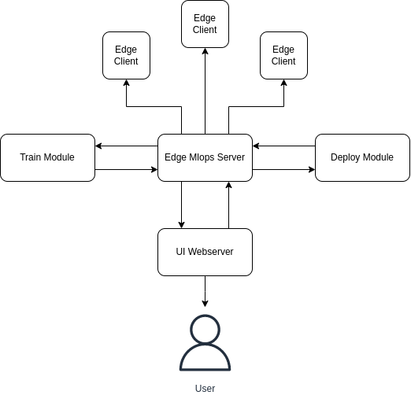

# Task Specifications
In this document, our framework tasks are described. 

## Edge Mlops Server
This component is the core of the system that manages all other modules and interact with them. The following figure shows the overall system architecture:
<center> 

</center>

The main responsibilities of edge mlops server is as follows:
+ Interacting with `Train Module`
+ Interacting with `Deploy Module`
+ Managing edge devices
    1. Registering new devices
    2. Transferring files and commands
    3. Checking device health (status)
+ Serving UI through `UI Webserver`
+ Starting modules and checking their health

## Train Module
Model training and reporting model performance is done in this component. The training must be automated and be versioned. The tasks of this module are:
+ Model training
+ Reporting model performance
+ Setting hyperparameters
+ Versioning the model
+ Downloading and managing the dataset

## Delpoy Module
Code compilation and generating final executable is handled in this component. It's a Docker container that has required toolchain, libraries, etc. for a specific hardware. As of now, it's capable of compiling code for Armv7 architecture with only ONNXRuntime library. Its responsibilities are listed as follows:
1. Compiling pipeline C/C++ code for different architecture
2. Generating standalone executables
3. Pacakging executable along with required files
4. Supporting important libraries such as OpenCV

## UI Webserver
This component serves an UI to the users so that they can interact with the framework. It must have the following capabilities:
+ System management:
    1. Monitor depolyed models
    2. Monitoring model performance or statistics
    3. Rerun the pipeline based on a trigger mechanism
    4. Specify hardware resources used for training
+ Model based actions:
    1. Selecting a pipeline to be deployed
    2. Update model on devices
    3. Reporting training parameters (accuracy, F1 score, etc.)
+ Device based actions:
    1. Add new devices
    2. Remove devices

A pipeline is defined as a set of dataset, preprocessings, model, and postprocessings. It might be in the form of a JSON file:

```json
{
    "dataset":{
        "name": "...",
        "path":{
            "train": "...",
            "test": "..."
        }
    },
    "model":{
        "name": "...",
        "hyperparams": {
            "lr": 1e-3,
            "batch_size": 32,
            "epochs": 20
        },
    },
    "preproc": {
        "pipeline": ["resize", "hwctochw", "scale"],
        "params": {
            "resize": [244, 244],
            "scale": [-1, 1]
        }
    },
    "postproc": {
        "pipeline": ["nms"],
        "params": {
            "nms": {
                "IoU_thr": 0.8,
                "conf_thr": 0.6
            }
        }
    }
}
```

This component only act as a way for users to interact with the whole framework.

## Edge Client
Each edge device must be capable of receiving files and trasnfering data to the `Edge Mlops Server`. Therefore, we need an app that can run on most devices and could handle file and data transfer through data network. The protocols and program itself must be defined so that it can meet the module's functions.
### Functions:
- [x] Transfer file and data 
- [x] Managing executable and making sure its alive
- [x] Reporting model and device status
- [] Update model
- [] Run on any device with no excessive overhead
